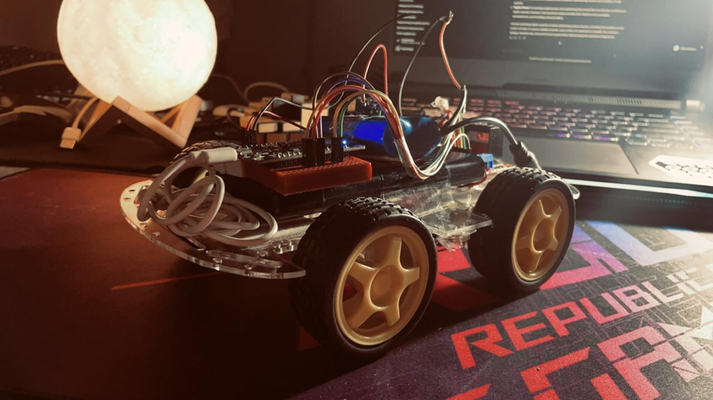
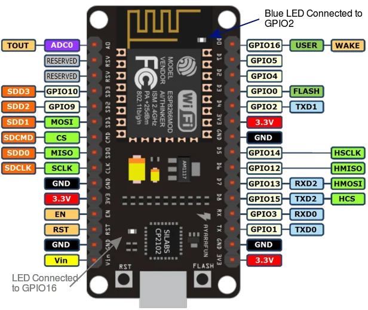

# 4-Wheeled Bot Project

## Description

This repo contains details and code for creation of a four-wheeled, app-controlled car. It utilizes an ESP 8266 microcontroller for wireless communication, allowing you to steer the car from your phone.

## Hardware Used

- ESP 8266 microcontroller
- 12V LiPo battery/ Suitable Powerbank
- L298N motor driver (DC)
- Jumper wires and breadboards

## Wiring Diagram

Below is the wiring diagram for connecting the components:

## Code

The code for controlling the car/bot is written in Arduino IDE using Arduino C. You can find the code in the `code` folder in this repository.

### Code Features

- The `speedcar` variable allows you to vary the maximum speed of the car. Adjust this value to control the car's speed according to your requirements.
- The `speed_coeff` variable allows you to change the speed coefficient of the car. Modify this value to fine-tune the car's responsiveness to speed adjustments.
- The `ssid` variable can be changed to set the desired SSID for the car to establish a Wi-Fi connection.
- The `password` variable is used to secure the Wi-Fi connection with the specified SSID.

## Control Instructions

To control the car/bot:

1. Connect your phone wirelessly to the ESP 8266 module.
2. Launch the NodeMCU_car app on your phone.
3. Follow the instructions in the app to drive the car/bot.

## Usage

Please ensure that you have set up the hardware components correctly and uploaded the `code.ino` file to the ESP 8266 using the Arduino IDE.
In case you are having trouble selecting the ESP module in the Arduino IDE, here's a link:
[StackOverflow](https://stackoverflow.com/questions/50080260/arduino-ide-cant-find-esp8266wifi-h-file){:target="_blank"}
